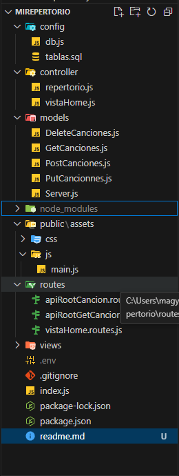

# Aplicación CRUD de Canciones - Documentación

## Descripción

Esta aplicación CRUD de canciones fue desarrollada para un proyecto de Desafío Latam sobre Levantar un servidor con
conexión a PostgreSQL, Insertar registros, Consultar registros, Actualizar registros y Eliminar
registros.  

La Escuela de Música "E-Sueño". Permite gestionar las canciones que serán interpretadas por los estudiantes de canto en las presentaciones en vivo. El servidor está construido con Express, se conecta a PostgreSQL utilizando el paquete pg, y utiliza funciones asíncronas para realizar consultas a la base de datos.

## Tecnologías Utilizadas

- Node.js
- Express.js
- PostgreSQL
- Handlebars
- MVC (Modelo-Vista-Controlador)

## Rutas Disponibles

1. **POST /cancion**
   - Descripción: Recibe los datos correspondientes a una canción y realiza la inserción en la tabla canciones.
   - Parámetros de entrada: Datos de la canción (nombre, artista, tono).
   - Retorna: Mensaje de éxito o error.

2. **GET /canciones**
   - Descripción: Devuelve un JSON con los registros de la tabla canciones.
   - Retorna: JSON con la lista de canciones.

3. **PUT /cancion**
   - Descripción: Recibe los datos de una canción que se desea editar y ejecuta una función asíncrona para hacer la consulta SQL y actualizar ese registro de la tabla canciones.
   - Parámetros de entrada: Datos de la canción a editar.
   - Retorna: Mensaje de éxito o error.

4. **DELETE /cancion**
   - Descripción: Recibe por queryString el id de una canción y realiza una consulta SQL a través de una función asíncrona para eliminarla de la base de datos.
   - Parámetros de entrada: ID de la canción a eliminar.
   - Retorna: Mensaje de éxito o error.

## Estructura del Proyecto

El proyecto sigue el patrón de diseño Modelo-Vista-Controlador (MVC), con la siguiente estructura de carpetas:

-[]

## Vistas

Las vistas de la aplicación se encuentran en la carpeta `views/`. Aquí hay algunas capturas de pantalla de las vistas disponibles:

### 1. Vista Principal (index.handlebars)
   - []

